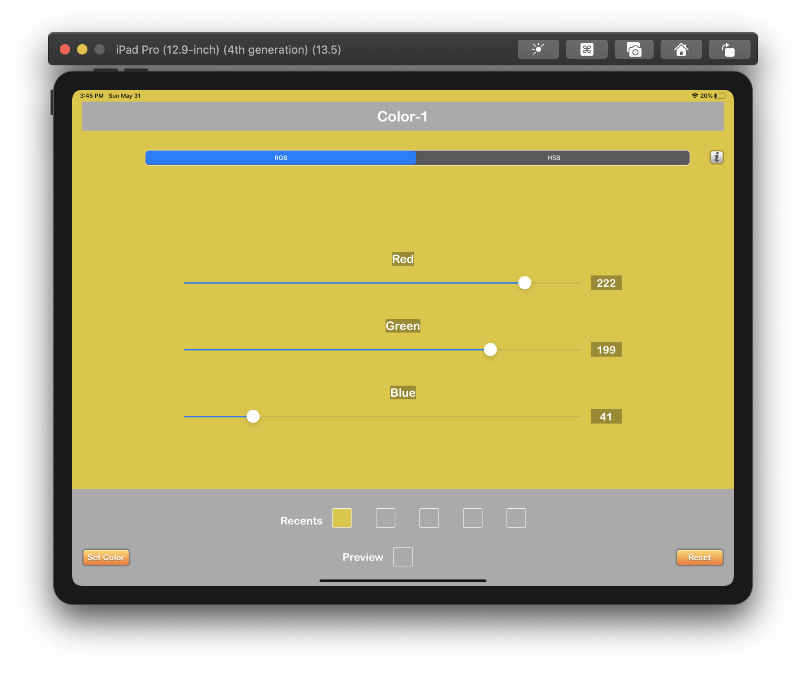
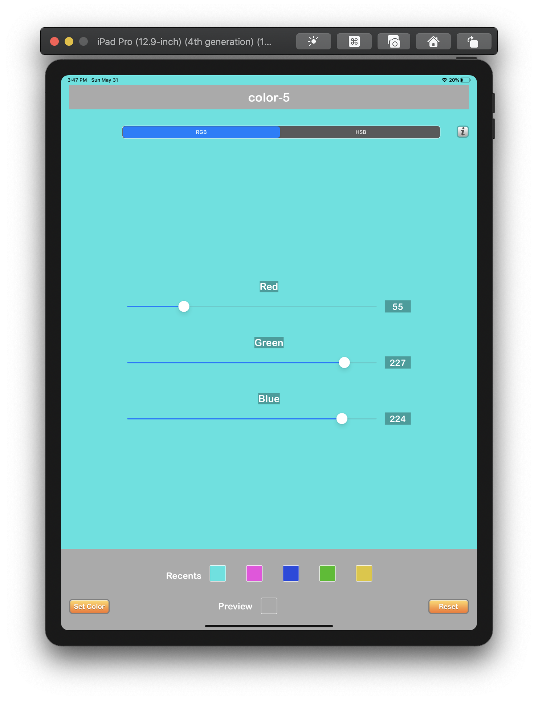

# Color Picker App
[About](#about) 
[Biography](#bio) 
[App Details](#app) 
[Screenshots](#screenshots) 
 
## About
<a name = "about" />This app allows user to pick a color with either "RGB" or "HSB" values. The selected color is set as background of the main view. The preview area at the bottom helps user to see the selected color before naming and setting it on the background. This app supports iPhone and iPad in both the orientations. There is a 'Recent Color History' feature which is available only in iPad.

## Biography 
<a name = "bio" /> 
  

**Name** - Shruti Sharma  
**Discord Name** - TK:Shruti  
**Basic Location** - Los Angeles (USA/CA)  
**Programming experience** - 6 yrs as iOS Developer in Objective C  
**Goals**
- Get proficient in iOS Development 
- Learn how to drive 
- Workout more often 
- Practise mediation more 
- Travel around the world 
**Hobbies and Interests** - Reading, Cooking, Playing tennis

## App Details
<a name = "app" />

### Basic UI Requirements

The UI consists of the following:  
- [x] A label near the top of the view (for displaying a color name).
- [x] 3 Sliders, one representing each color range.
- [x] A label above each slider (Used to indicate what that slider is for).
- [x] 3 labels, each positioned next to a slider, capable of displaying a string.
- [x] A button called “Set Color”
- [x] A button called “Reset”
- [x] The sliders should default to the leftmost position.
- [x] The labels next to sliders should show 0 by default. 
- [x] The title labels above the sliders should read “Red”, “Green” and “Blue” in that order.

### Basic Functional Requirements

- [x] When moving a slider, the label to its right should update with an integer from 0 - 255.
- [x] When the “Set Color” button is hit, an alert should appear asking the user to enter a color name.
- [x] Once a name is entered and the user presses “Enter” on the keyboard, the background of the app changes to a color corresponding to the RGB values entered by the sliders and their color name appears in the top label. 
- [x] The alpha value should be hard-coded to 1.0, as we won’t be addressing transparency here.
- [x] When “Reset” is hit, the sliders, labels and background color should return to the default values.
- [x] The app should have a splash screen and app icon.
- [x] The app should work in landscape and portrait orientation.
- [x] The app should have an info button that presents the wikipedia page for RGB. That page should have a Close button to dismiss it.

### Optional Stretch Goals 

- [x] Expand upon your original implementation to allow the user to use either RGB or HSB to define their color.
- [x] The max range will need to change on the slider.
- [x] The title labels above the sliders should change from “Red”, “Green” and “Blue” to be “Hue”, “Saturation” and “Brightness”.
- [x] The existing selections should be reset to avoid confusion.
- [x] Sliders, value labels and color name labels are reset when user switches between RGB and HSB.
- [x] Now when the "Set Color" button is pressed to set the color, calculations are done based on RGB and HSB.

### Additional Features
- [x] Keyboard has “Done” button which corresponds to “OK” button on alert. To close the alert user need to click OK button or “done” on keyboard.
- [x] "Cancel" button on alert to dismiss the alert.
- [x] A color preview is visible when the user moves the slider.
- [x] Simple validation on color name - leaving it blank or entering all whitespaces shows “(No Name)”
- [x] The app also supports iPad.
- [x] Recent Color History (interactive) upto 5 colors for "RGB" and "HSB" each is visible in iPad.

## Screenshots
<a name = "screenshots" />

### iPhone
  

### iPad
  
