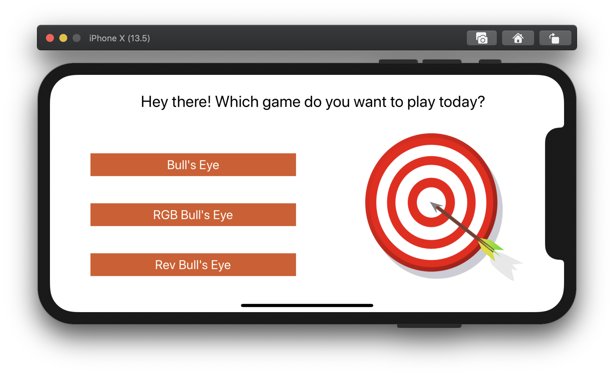
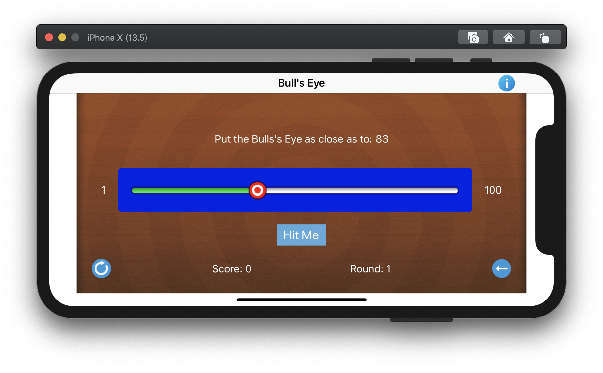
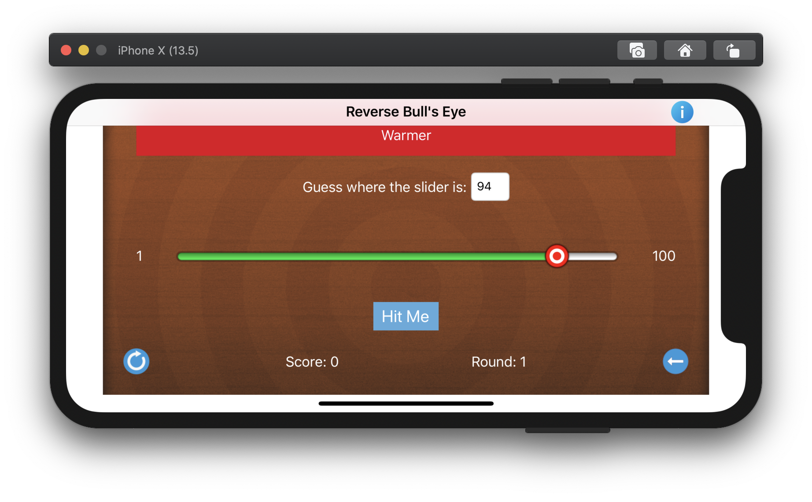
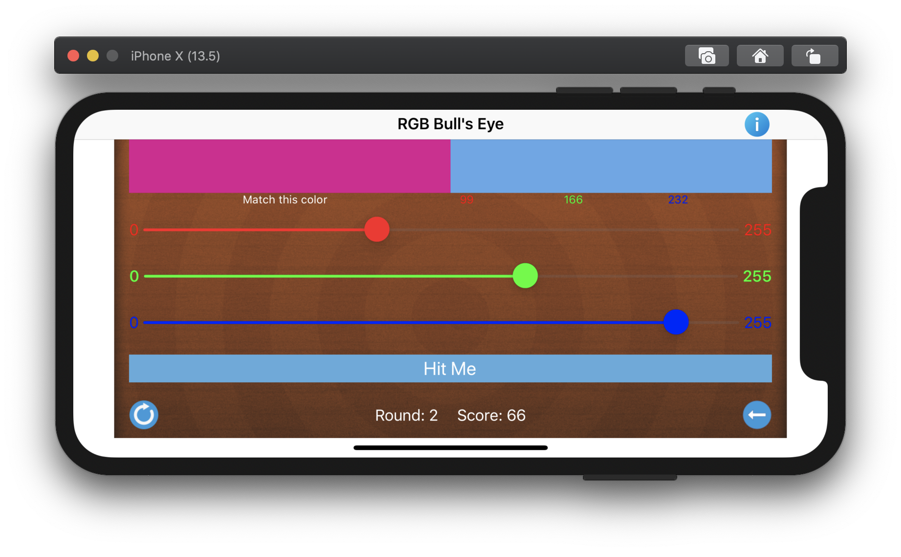
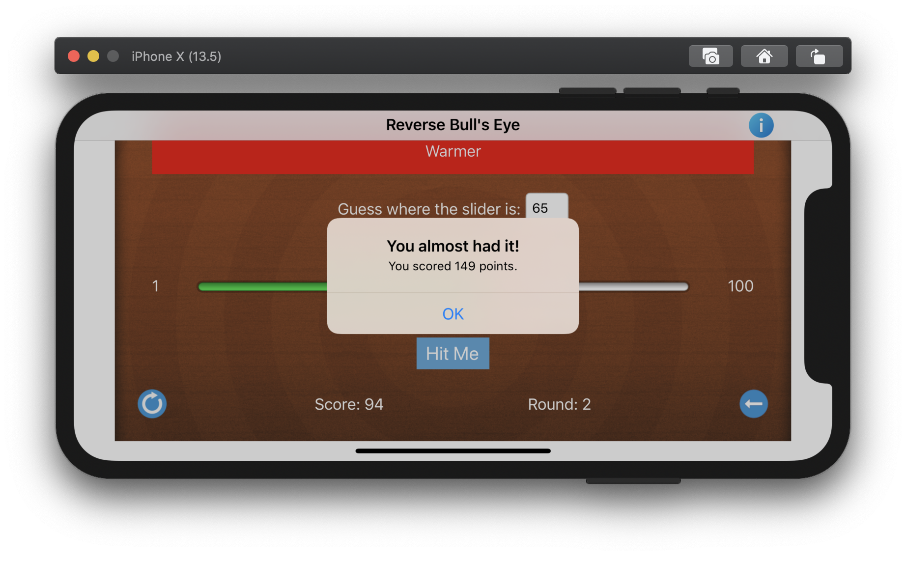
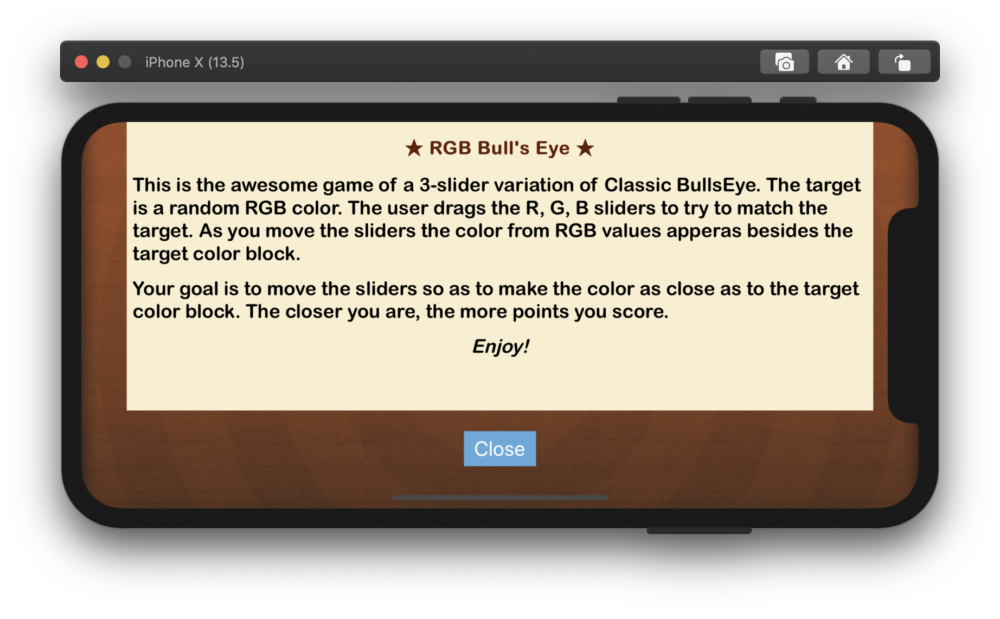

# BullsEye App
[About](#about) 
[Biography](#bio) 
[App Details](#app) 
[Screenshots](#screenshots) 
 

## About
<a name = "about" /> This project refactors the original **Bull's Eye app** code to implement MVC design pattern. A model struct **BullsEyeGame** (UI-independent ) is implemented which contains the game logic.  ViewController is refactored to use this model object and present the game on the screen. The same model is used to implement **RGB Bull's Eye** and **Reverse Bull's Eye**.

__Bonus__: The third app **ThreeInOneBullsEye** combines all three apps into one to demonstrate the UI independence of the model and to introduce some advanced concepts. 

#### The big question: Struct or Class for BullsEyeGame model?

In this app, Game model is a data structure to hold data and methods related to the game logic. 

As per the [Apple documentation](https://developer.apple.com/documentation/swift/choosing_between_structures_and_classes) below are the following recommendations to help choose which option makes sense when adding a new data type to your app.

- Use structures by default.
- Use classes when you need Objective-C interoperability.
- Use classes when you need to control the identity of the data you are modeling.
- Use structures along with protocols to adopt behavior by sharing implementations.

Major difference between Structures and Classes
 1. Structures are ‘Value Types’ and don’t live in the heap (live in the stack) as we pass around or assign to another instance of same type it gets copied using copy-on write semantics
 2. On the other hand Classes are ‘reference types’(which live in the heap) wherein everytime it is assigned or passed around then the two instances are referencing the same data. Making a change to one instance also changes the other instance.

I started with ‘class’ as the game logic model for my app but then later on I changed it to ‘struct’. **I chose ’struct’ as the data type for my Game model because** -

1. Game object does not need to be shared across the app and even if there is a use case for this we do not want changes made to that instance by one view controller to be visible to every part of the code that holds a reference to that instance.
2. Game model do not have to use any Objective C interoperability.
3. Game object is declared private in the ViewController class thus no other class can access and modify it.
4. In the ‘ThreeInOne’ BullsEye app I wanted to use one BullsEyeGame model for all the three games. In order to achieve this functionality I needed to use some kind of inheritance so as to model a slight different behaviour(generate a random target value and calculate difference between guess and target value) based on the type of game selected. Thus I tried building the hierarchy of data types using protocol inheritance first, then adopt those protocols in my structures.

## Biography 
<a name = "bio" /> 
 **Name** - Shruti Sharma  
**Discord Name** - TK:Shruti  
**Basic Location** - Los Angeles (USA/CA)  
**Programming experience** - 6 yrs as iOS Developer in Objective C  
**Hobbies and Interests** - Reading, Cooking, Playing tennis  
**Goals**

- Get proficient in iOS Development 

- Learn how to drive 

- Workout more often 

- Practise mediation more 

- Travel around the world

  

## App Details
<a name = "app" /> 

### Basic Functional Requirements - BullsEye

- [x] Move the game logic out of the view controller into a **BullsEyeGame** type. 
- [x] Create a new Swift file (not Cocoa Touch). This file imports **Foundation**, not UIKit. BullsEyeGame is your **UI-independent model** type, so you should not write any UIKit code in it!
- [x] Refactor the code in **ViewController** and in **BullsEyeGame** into new or modified methods. 
- [x] **ViewController** will contain only code that creates a **BullsEyeGame** object, then uses its properties and methods to present the game on the screen. 
- [x] The game itself will work exactly the same.
- [x] **A Treat: BullsEye Hint** - Add a hint to BullsEye. It sets the slider’s minimum track tint color to blue with alpha set to difference/100. This means the minimum track tint color fades to white as the slider thumb gets closer to the correct position. 

### Basic Functional Requirements - RGBullsEye

- [x] To test your game model created in BullsEye, modify it to handle a 3-slider variation of BullsEye. The target is a random RGB color. The user drags the R, G, B sliders to try to match the target.
- [x] Modify your BullsEyeGame and ViewController code to implement **RGBullsEye**. If you’re doing it right, you won’t need to change much beyond using RGB objects instead of numbers.

### Optional Stretch Goals - RevBullsEye 

- [x]  **Reverse the BullsEye game**. Instead of moving the slider to match a displayed number, the game presents the slider with its thumb already positioned at the target value. The user then enters a guess for that value in a text field.
- [x] This app uses the **same BullsEyeGame model** used in original BullsEye to implement the game logic.
- [x] **To help the user**, a colored view with help text appears above the textfield as soon as the user starts typing in. This view's color changes to the red and text to 'Warm' or 'Warmer' if the user is moving closer to the target. Conversely its color changes to the blue and text to 'Cold' or 'Colder' if the user is moving away from the target.

### Additional Features - ThreeInOne BullsEye 
- [x] This app contains all the three variations of BullsEye game - **Classic BullsEye, RG BullsEye and Rev BullsEye**. 
- [x] This project uses concept of **Generics** to handle variation of game logic target values for all three games.
- [x] **BullsEye Hint** - The hint is now a gradient colored box which changes color from blue (cold) to red (warm) based on the distance between the guess and the target. In Classic Bull's Eye, this box appears around the slider, and in Reverse Bulls Eye this box appears on top with the text associated with the color.
- [x] Modifed logic for calculating the difference between two RGB objects in RGB BullsEye to get more correct results.

## Screenshots
<a name = "screenshots" />

      

