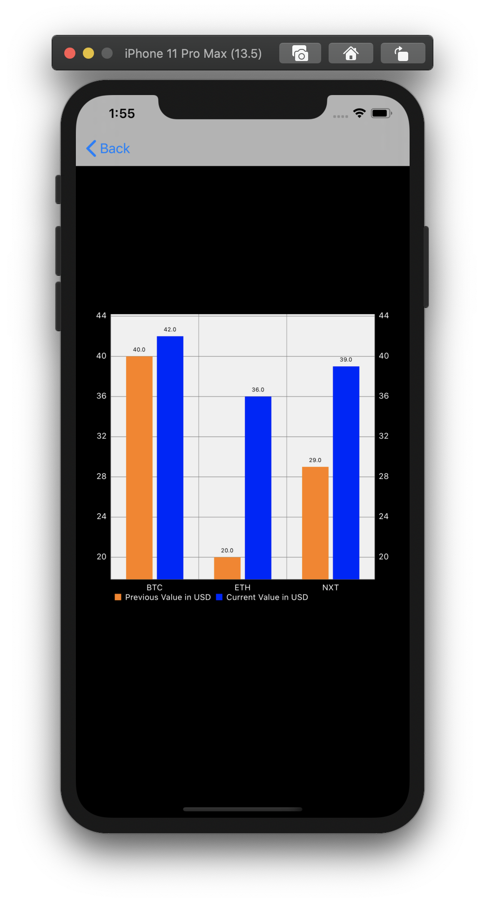
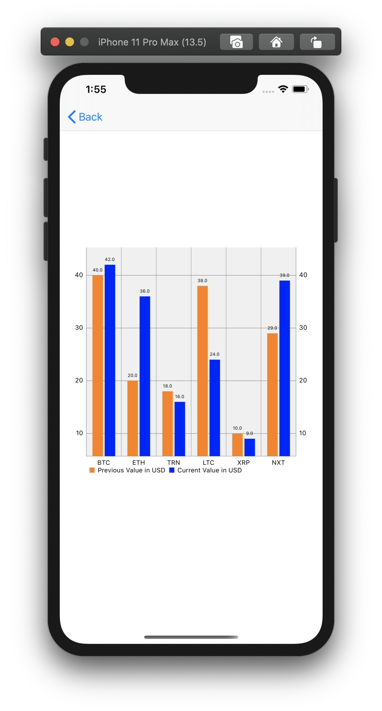

# Cryptly App
[About](#about) 
[Biography](#bio) 
[App Details](#app) 
[Screenshots](#screenshots) 
 

## About
<a name = "about" /> This app displays prices of cryptocurrencies. The home screen lists all currencies, rising and falling currencies depending on their current and previous market value.

**Bonus - The app displays the currencies data in the form of bar charts as well. Tapping each currency data view takes user to the next screen to see the current value for the currencies.**

## Biography 
<a name = "bio" /> 
    

**Name** - Shruti Sharma  
**Discord Name** - TK:Shruti  
**Basic Location** - Los Angeles (CA/USA)  
**Programming experience** - 6 yrs as iOS Developer in Objective C  
**Hobbies and Interests** - Reading, Cooking, Playing tennis  
**Goals**

 - Get proficient in iOS Development 
 - Learn how to drive 
 - Workout more often 
 - Practise mediation more 
 - Travel around the world

## App Details
<a name = "app" /> 

### Basic Requirements
- [x] Displays prices of cryptocurrencies.
- [x] If you tap the button in the upper right corner, it should change to a different color theme.
- [x] Define the data model for CryptoCurrency. It has the following requirements:
  name(of type string), symbol(of type string), currentValue(of type Double) and previousValue(of type Double).
- [x] Load cryptoData before viewDidLoad
- [x] In the first view, you have to display a comma separated list of every currency you own.
- [x] In the second view, you have to display a comma separated list of every currency which increased from its previous value.
- [x] And in the third view, display a comma separated list of every currency which decreased from its previous value. 
- [x] Define a protocol named '**Theme**'. Its members should be:
  backgroundColor of type UIColor - View’s background colortextColor of type UIColor - Text ColorsborderColor of type UIColor - Border color of views which contain datawidgetBackgroundColor - BackgroundColor of views which contain data
- [x] Define two themes that conform to this protocol. You can name them anything, but for purposes of this document, we’ll call them **LightTheme** and **DarkTheme**.
- [x] Use '**ThemeManager**' whenever you need to get (or set) the current theme.
- [x] Back in Theme.swift, define a new protocol called **Themeable**. It should contain three methods with no parameters: **registerForTheme**(), **unregisterForTheme**( ), and **themeChanged**( ).
- [x] Add an extension to HomeViewController that implements the methods on Themeable protocol. 
  - [x] **registerForTheme**() should use NotificationCenter to add the current object as an observer for when the “themeChanged” notification occurs. 
  - [x] **unregisterForTheme**() should remove the current object as an observer. 
  - [x] **themeChanged()** should:For view1, view2, view3:Set the backgroundColor to the current theme’s widgetBackgroundColorSet the layer’s border color to the current theme’s borderColorFor view1TextLabel, view2TextLable, view3TextLabel:Set the textColor to the current theme’s textColorFor the main view:Set the backgroundColor to the current theme’s backgroundColor
- [x] Call **registerForTheme**() in HomeViewController’s **viewWillAppear**(:_), and **unregisterForTheme**() in HomeViewController’s **viewWillDisappear**(:_).Implement **switchPressed**(), to set the theme to dark if the switch is on, or light otherwise.
- [x] Use higher order functions like **map, filter, reduce**.

### Optional Stretch Goals 

- [x]  There’s a lot of common code in **setupViews()** function. Make the method completely empty by making a subclass of UIView. 
- [x] Add a new section to the app that shows the currencies that have been rising or falling the most.
  - [x]  Add two new variables to CryptoCurrency:
    **trend,** which is an enum type Trend, which has two cases: rising and falling. Assign the case depending on whether the currency has risen or fallen.**valueRise**, a float value which is the rise between the current and the previous value
  - [x] Also add two new views to your storyboard, both of which take half of the view’s width, using a **StackView**.
    In each new view, add two labels: a heading label and a body label. 
    Set one of the heading labels to **Most Falling** and the other to **Most Rising**.
    The body labels should display the values for the most falling and the most rising currency difference from the data.
- [x] Also, to have rounding corners on the view, introduce a protocol called **Roundable.** It contains two parts — a variable **cornerRadius** which is a **CGFloat,** and a function **round()** which uses aforementioned **cornerRadius**  to round corners. Also try to implement a default implementation of the method and try experimenting with different **cornerRadius** values for different view classes. Make sure **Roundable** can only conform to a UIView.

### Additional Features 
- [x] The currency data views are interactive. 
- [x] The app displays the currencies data in the form of  bar charts.
  - [x] Tap on the currency data views and see the current value of the respective currencies.

## Screenshots
<a name = "screenshots" />

   

