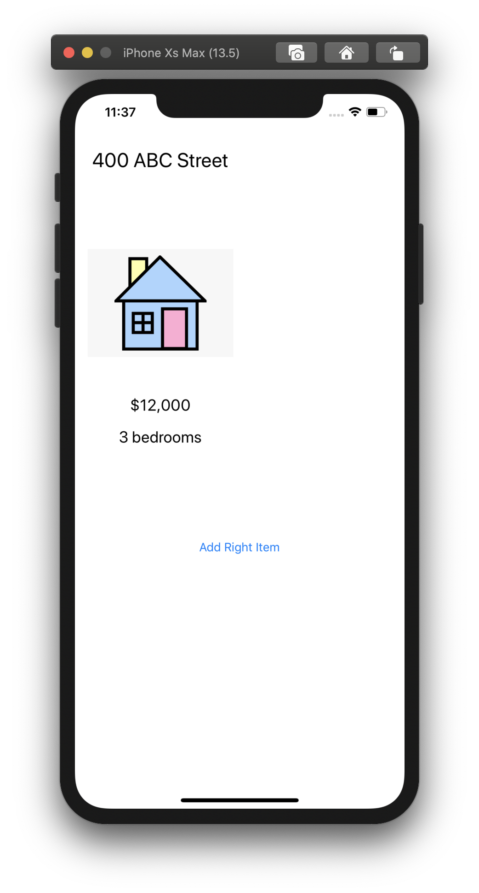
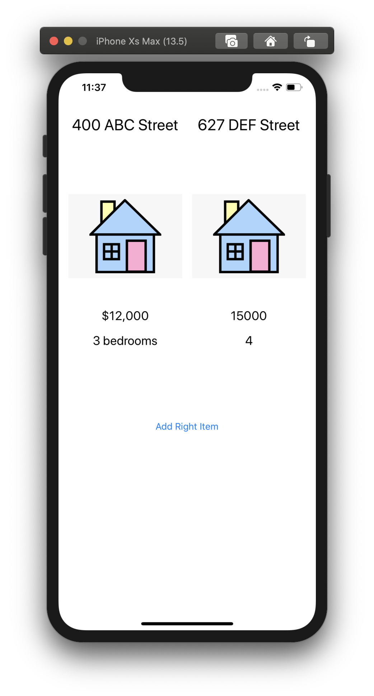

#  App
[About](#about) 
[Biography](#bio) 
[Screenshots](#screenshots) 
[App Details](#app) 
 

## About
<a name = "about" /> 

## Biography 
<a name = "bio" /> 
    

**Name** - Shruti Sharma  
**Discord Name** - TK:Shruti  
**Basic Location** - Los Angeles (CA/USA)  
**Programming experience** - 6 yrs as iOS Developer in Objective C  
**Hobbies and Interests** - Reading, Cooking, Playing tennis  
**Goals**

 - Get proficient in iOS Development 
 - Learn how to drive 
 - Workout more often 
 - Practise mediation more 
 - Travel around the world

## Screenshots
<a name = "screenshots" />

## App Details
<a name = "app" /> 

### Basic Requirements
- [ ] 

### Optional Stretch Goals 

- [ ]  

### Additional Features 
- [ ] 

