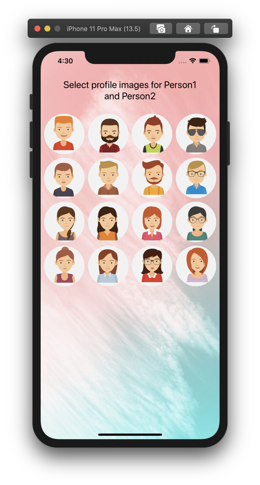
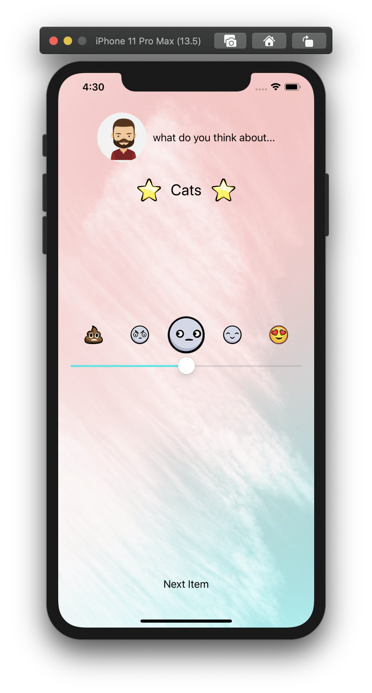
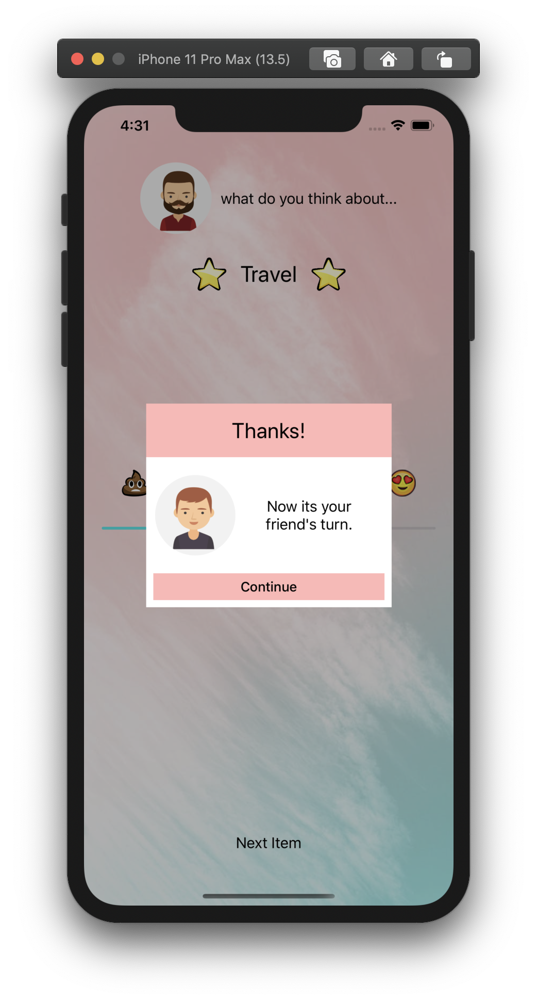
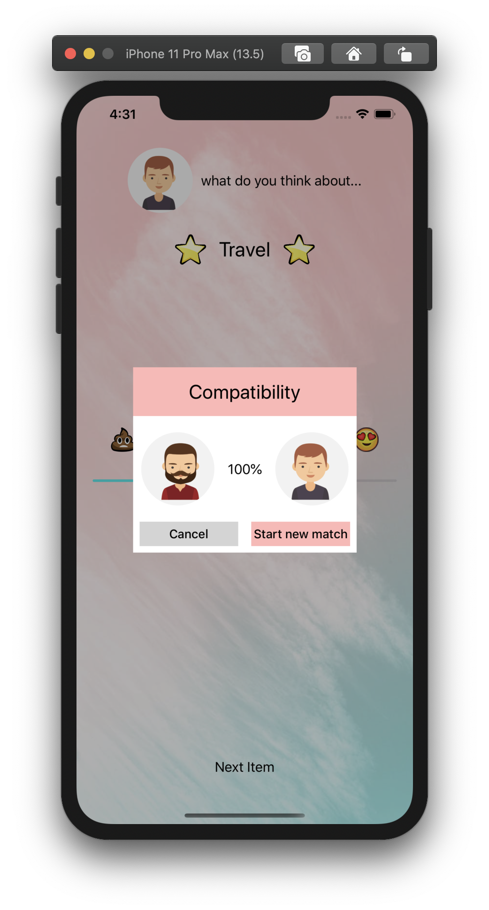

#  Compatibilty App & ComparsionShopper App(Bug fixes)
[About](#about) 
[Biography](#bio) 
[Screenshots](#screenshots) 
[App Details](#app) 
 

## About
<a name = "about" /> 

**Compatibility App -** It is a mini compatibility app that gathers responses of two players on a few topics and depending on their respective responses match their compatibility to each other.

**Comparison Shopper Project** - This project inlcudes a few bug fixes.

## Biography 
<a name = "bio" /> 
    

**Name** - Shruti Sharma  
**Discord Name** - TK:Shruti  
**Basic Location** - Los Angeles (CA/USA)  
**Programming experience** - 6 yrs as iOS Developer in Objective C  
**Hobbies and Interests** - Reading, Cooking, Playing tennis  
**Goals**

 - Get proficient in iOS Development 
 - Learn how to drive 
 - Workout more often 
 - Practise mediation more 
 - Travel around the world

## Screenshots
<a name = "screenshots" />

#### Compatibilty App

## App Details
<a name = "app" /> 

### Compatibility App

#### Basic Requirements 

- [x] Use your autolayout stack view and flexible view knowledge to line up the elements. Support potrait and landscape modes.

- [x] When the user opens the app, the top label should say “User 1, what do you think
  about...”

- [x] The label with stars next to it should have the name of the first item in the
  `compatibilityItems` array.

- [x] The user can move the slider and give that item a score between 1 and 5.

- [x] When the user presses the “next item” button, you need to save their score for that first
  item as a dictionary.

- [x] After you save that info, go on to the next item in the array for Person1. A good way to
  keep track of what item you’re on is to increase `currentItemIndex` after you save the
  info.

- [x] When you get to the last item in the array, change the currentUser to person2, change
  the top label to say “Person 2, how do you feel about...”, start the array over, and do the
  exact same thing as before.

- [x] When you have finished with person 2, calculate both users compatibility scores and
  show a UIAlert telling the users their score.

- [x] Reset the game to the beginning when the UIAlert comes up.

- [x] Make sure to test your code a few times before you submit it, and watch out for crashes.
  If you try to access `compatibilityItems[currentItemIndex]` but `currentItemIndex` is a
  higher index than the last item in the array, you’ll crash your app!

  

#### Additional Features 

- [x] App displays a **list of avatars** on the home screen for the user to choose for person1 and person2.
- [x] **A profile image** is displayed for the player on the game screen.
- [x] A custom alert view appears for player1 when player1 has finished playing.
- [x] **A custom alert view** appears with the players profile images of both the players and their compatibilty score.
- [x] **Unit Tests** for Compatibility game logic.

#### Technical Implementations

- Uses UICollectionView to create a grid of avatar images.

- Uses separate Storyboard to create custom alert view.

- Uses Auto Layout to line up the  UI elements on screen.

- Uses Extensions for UIView, NumberFormatter.

  

### ComparsionShopper App

#### Basic Requirements 

- [x] Fix the crash that appears when the app is opened. Add breakpoints and use lldb to see if anything is nil. You can also use lldb commands after a crash to view values at the time of the crash.

  Steps for crash resoluton -  

  1. The code was trying to access house1 which was nil as it was not initilaized. Type command 'po house1' in the debug console and it returns nil. 

  ​       Fix - Initialize house1 using the memberwise initializer.

  2. address property of house1 was nil.

  ​       Fix - Initialize house1 using the memberwise initializer.

  3. setUpLeftSideUI() was called before the properties for house1 were set and thus the code here was trying to access the properties of a nil object.

     Fix - Call setUpLeftSideUI() after initializing the house1 structure object.

  4. property roomLabelLeft was nil as the respective IBOutlet wasn't hooked up in IB.

     Fix - Connect the property roomLabelLeft in the IB.

- [x] Fix the bug - If the user adds a second house to compare, none of the labels or images
  show up. Add breakpoints to make sure the correct code is running!

  Steps for bug fix - 

  The data for house2 details was not visible after adding the item because the properties (titleLabelRight, imageViewRight, priceLabelRight, roomLabelRight) all had alpha 0.0. Set the alpha to 1.0.

