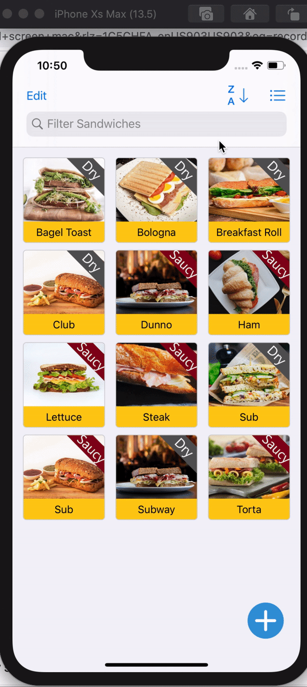
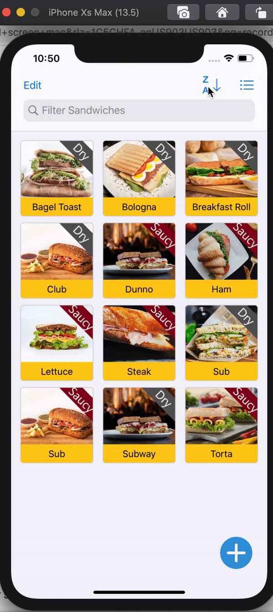
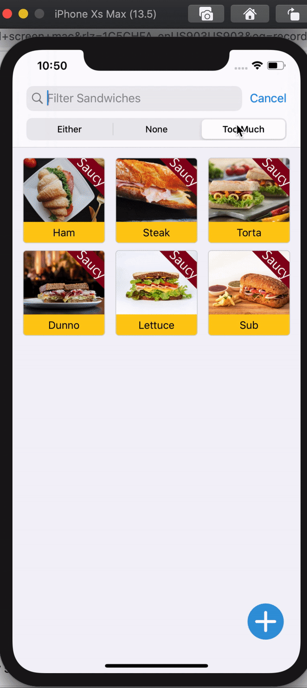
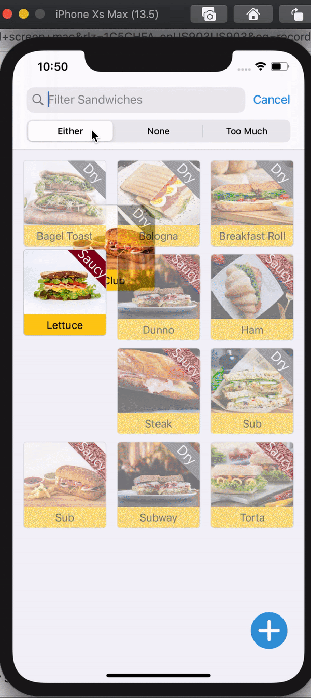

# SandwichSaturation App
[About](#about) 
[Screenshots](#screenshots) 
[App Details](#app) 
 

## About
<a name = "about" />This app list sandwiches based on sauce amount. The initial data is seeded from json file and persisted in the database. The user can add, edit, search, filter and delete sandwiches.

## Screenshots
<a name = "screenshots" />  

      

## App Details
<a name = "app" /> 

### Basic Requirements

- [x] Save the selected index of the search scopr button items into User Defaults.
- [x] Remove the code in loadSandwiches() and instead load from the included **sandwiches.json** file
- [x] Create a Core Data model representing your sandwich properties
- [x] For the first launch with Core Data implemented, take the data you are already loading from JSON, and save it to Core Data
- [x] Use Core Data to retrieve data for display in the Table View
- [x] When a user saves a sandwich using the Add Sandwich view controller, ensure it is saved to Core Data
- [x] Re-wire the filter (text and scope bar) functionality to use Core Data queries rather than filtering the data array directly
- [x] Inside the Core Data Class extension for your SauceAmount entity, create a computed property that will convert this String to and from SauceAmount.

**Ques** - Describe at least one other option for packaging seed data like this with an app. Which do you think makes the most sense if you were shipping **SandwichSaturation**, and why?

**Ans** - 1. ***Fill in Core Data on startup from external source* like JSON/Plist file.** Seed data can also be packaged in Propery List (Plist file) where the data is saved in key-value pairs and can be decoded using PlistDecoder. 

2. ***Provide pre-filled in SQLite database.***  Core Data creates the database structure based on the model, and then we populate the database with a utility app. The utility app could be a Mac or iPhone app that uses Core Data to populate the database via Core Data APIs, or some kind of program that fills in the SQLite database directly. Once the database is populated, just include it with the app and make the app use it as the default database if no database already exists.

I would prefer to go with the second option. Here the app is shipped with a prefilled database which reduces the overheads of checking if data exists in database or writing code to manually add data in the database at app launch. This method is error free, faster and easier to work with as well. The app is more reliable as it has a prebuilt database.

###  Stretch Goals 

- [x] Allow users to delete sandwiches from the table view. When deleted, be sure they are deleted from Core Data.

### Additional Features
- [x] The user can change the layout of sandwiches view to grid or list. Modified the entire starter code for this.
- [x] The user can edit a sandwich.
- [x] The user can sort sandwiches.

